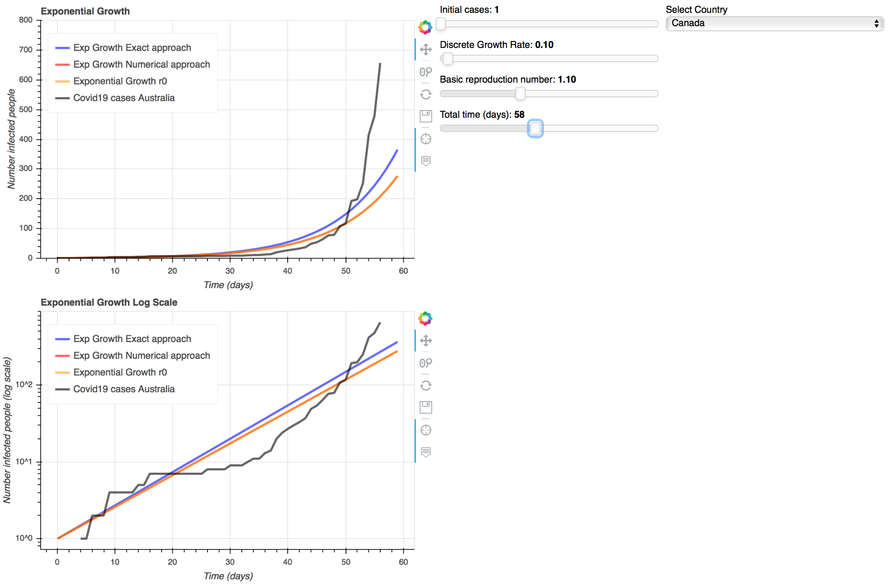

A collaborative project for teaching and understanding SARS-CoV-2 virus and COVID19 disease
=======

This project seeks to create interactive tools which can be used to teach and understand the SARS-CoV-2 virus, COVID19 disease, as well as biological, ecological and epidemiological aspect related to pathogens transmission.

This project is open to collaboration.

